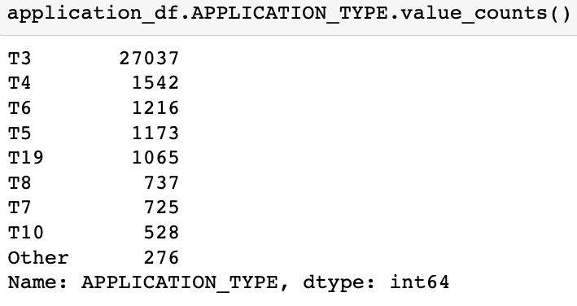
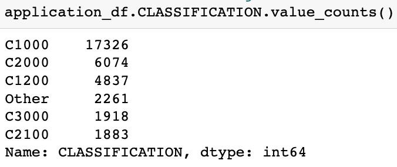
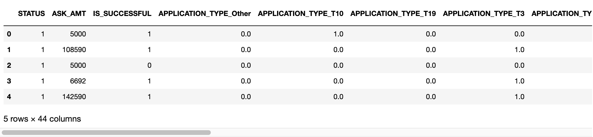
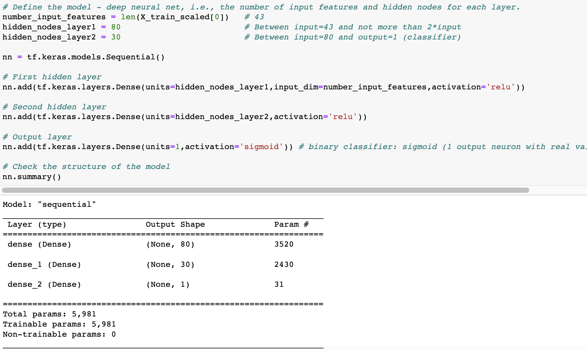
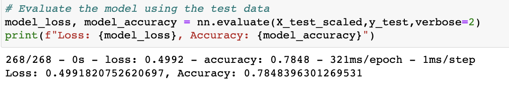
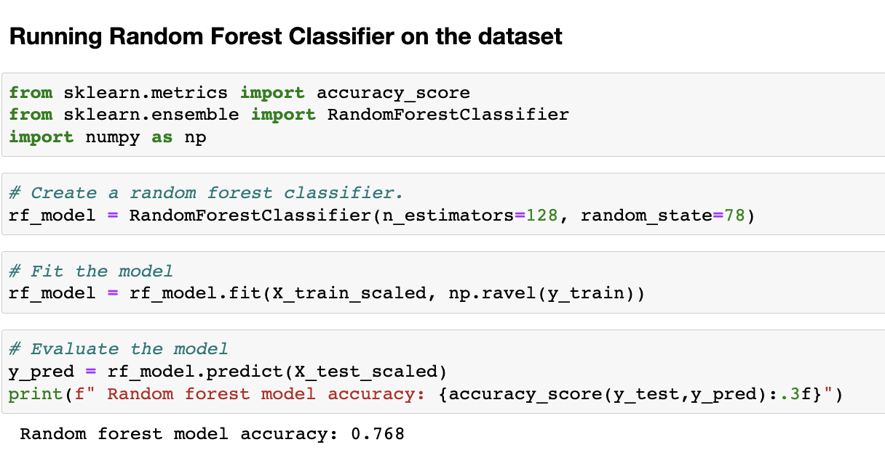

# Neural_Network_Charity_Analysis

## Overview of the analysis

Beks is a data scientist for non profit foundation Alphabet Soup, which is dedicated to help organizations that protect the environment and improve overall people well being. Her job is to analyze the impact of each donation and vet potential recipients. This helps ensure that the foundation’s money is being used effectively. Because every donation the company makes is not impactful, the project aims to help Beks **predict which organizations are worth donating to and which are high risk**. Since this problem is too complex for the statistical and machine learning models used, deep learning neural network will be designed and trained. The datasource is a CSV containing more than 34,000 organizations that have received funding from Alphabet Soup over the years. The below tasks will be achieved:
- Explore and implement neural networks using the TensorFlow platform in Python.
- Preprocess Data for a Neural Network Model.
- Create a binary classification model that can predict if a funded organization will be successful based on the features in the dataset.
- Compile, train, and evaluate the binary classification model to calculate the model’s loss and accuracy.
- Optimize the Model in order to achieve a target predictive accuracy higher than 75%.
- Store and retrieve trained models for more robust uses.

## Results

### Data Preprocessing

- The dataset has 34,299 organizations that have received funding from Alphabet Soup over the years. The columns that capture metadata about each organization in the dataset are as follows:
  - EIN and NAME—Identification columns
  - APPLICATION_TYPE—Alphabet Soup application type
  - AFFILIATION—Affiliated sector of industry
  - CLASSIFICATION—Government organization classification
  - USE_CASE—Use case for funding
  - ORGANIZATION—Organization type
  - STATUS—Active status
  - INCOME_AMT—Income classification
  - SPECIAL_CONSIDERATIONS—Special consideration for application
  - ASK_AMT—Funding amount requested
  - IS_SUCCESSFUL—Was the money used effectively  
- Among the columns of the dataset, **IS_SUCCESSFUL is the target variable** for the model. It contains the binary data that tells if the organizaton used the charity donation effectively or not.
- The **pre-processing started with dropping EIN and NAME columns because they were considered not beneficial (as targets or features)** in predicting the outcomes of the model. 
- APPLICATION_TYPE, AFFILIATION, CLASSIFICATION, USE_CASE, ORGANIZATION, STATUS, INCOME_AMT, SPECIAL_CONSIDERATIONS and ASK_AMT are considered as potential features that will eventually be encoded, split and normalized as inputs for the model.
- After the number of unique values for each column are determined, those columns that have more than 10 unique values are considered. The number of data points for each unique value in the column are determined and density plots are drawn to find distribution of values.
  - Any APPLICATION_TYPE that appears fewer than 500 times in the dataset is binned as "other".
  
  
  - Any CLASSIFICATION that appears fewer than 1800 times in the dataset is binned as "other."
  

- The categorical variables are encoded using one-hot encoding and merged into the original dataframe.

- Finally, the resultant dataset is split into "y" target and "X" features and divided into training and testing sets accordingly.
- The features data is scaled so that normalization prevents variations in the magnitudinal scaling between columns.

### Compiling, Training, and Evaluating the Model. 

- A neural network that performs binary classification by including a single neuron with sigmoid activation in the output layer and specifying binary_crossentropy as the loss function is built.
  - The initial **model has 43 inputs with 2 hidden layers and 1 output layer**. 
- Since [neural networks with two hidden layers](https://web.archive.org/web/20140721050413/http://www.heatonresearch.com/node/707) can represent functions with any kind of shape, two hidden layers are used in this model. To prevent underfitting with too few neurons and overfitting with excess neurons in hidden layers, the number of neurons < 2*(size of input layer) is used as a rule of thumb. Ultimately, the selection of an architecture for a neural network comes down to trial and error based on target requirements.
  - The first hidden layer has 43 inputs, 80 (< 2*43=86) neurons.
  - The second hidden layer has 80 inputs (number of neurons from first layer) and 30 neurons (< 2*80).
  - The output layer has 30 inputs (number of neurons from the second layer) and 1 neuron.
  - Both first and second **hidden layers are activated using RELU** (Rectified Linear Unit) function. The **output layer is activated using the Sigmoid** function (binary classification using single neuron to make predictions). For compilation, the optimizer used is adam and the loss function is binary_crossentropy.

- The model's target accuracy rate is greater than 75%. The model configuration used above has **73.17% accuracy rate and did not fulfill the target accuracy**. This is not a satisfying performance to help predict outcome of charity donations. To achieve the 75% target accuracy, several attempts are made to optimize the model. 
- Feature/Target considerations:
  - IS_SUCCESSFUL is still the target for the model during the attempts.
  - STATUS, SPECIAL_CONSIDERATIONS: Each have a 99% dominant value that can create noise. So, these columns along with EIN and NAME are not considered as targets or features. The rest are features for the model.
  - Additionally, INCOME_AMT is binned just like APPLICATION_TYPE and CLASSIFICATION. The output activation function used is Sigmoid. The below table uses these feature considerations for 5 attempts.
 <table>
  <tr>
    <td><strong>Attempt</strong></td>
    <td><strong>Change</strong></td>
    <td><strong>Hidden Layers - (Neurons) - (Activation)</strong></td>
    <td><strong>Epochs</strong></td>
    <td><strong>Accuracy Rate</strong></td>
    <td><strong>Observation w.r.t. initial model</strong></td>
  </tr>
  <tr>
    <td>1</td>
    <td>Increased neurons based on input features(38)</td>
    <td>2-(70,70)-(RELU,RELU)</td>
    <td>100</td>
    <td>73.10%</td>
    <td>Less inputs to model. Accuracy decreased slightly(0.07%).</td>
  </tr>
   <tr>
    <td>2</td>
    <td>Increased neurons in second layer</td>
    <td>2-(70,140)-(RELU,RELU)</td>
    <td>100</td>
    <td>73.15%</td>
    <td>Not much improvement in accuracy.</td>
  </tr>
  <tr>
    <td>3</td>
    <td>Added extra hidden layer; neurons increased</td>
    <td>3-(70,100,120)-(RELU,RELU,RELU)</td>
    <td>100</td>
    <td>73.29%</td>
    <td>Slight improvement(0.12%) in accuracy.</td>
  </tr>
  <tr>
    <td>4</td>
    <td>Epochs increased</td>
    <td>3-(70,100,120)-(RELU,RELU,RELU)</td>
    <td>200</td>
    <td>72.96%</td>
    <td>Accuracy decreased.</td>
  </tr>
  <tr>
    <td>5</td>
    <td>Activation function changed</td>
    <td>3-(70,100,120)-(TANH,TANH,TANH)</td>
    <td>150</td>
    <td>73.06%</td>
    <td>Decrease in accuracy.</td>
  </tr>
</table>

- Another attempt is made to revisit the feature allocation. The target variable is IS_SUCCESSFUL. EIN, STATUS, SPECIAL_CONSIDERATIONS are neither considered targets nor features. NAME column is considered as a feature this time. All NAMEs that took donation less than 10 times are binned as 'Other'. The model has 263 input features with 3 hidden layers using RELU as activation function over 100 epochs. An Accuracy rate of over 78% is achieved. A 5% improvement in accuracy over the initial model is observed.
<table>
  <tr>
    <td><strong>Attempt</strong></td>
    <td><strong>Hidden Layers - (Neurons) - (Activation)</strong></td>
    <td><strong>Epochs</strong></td>
    <td><strong>Accuracy Rate</strong></td>
  </tr>
  <tr>
    <td>6</td>
    <td>3-(130,30,10)-(RELU,RELU,RELU)</td>
    <td>100</td>
    <td>78.48%</td>
  </tr>
</table>

## Summary

- With over 75% accuracy, the model can correctly classify the points in test data 75% of the time. An applicant with Alphabet Soup has 78% chance of being approved a charitable donation if 
  - NAME appears more than 10 times.
  - The APPLICATION_TYPE is one of the following: T3, T4, T5, T6, T7, T8, T10 and T19.
  - The CLASSIFICATION with one of C1000, C1200, C2000, C2100 and C3000.
- More attempts can be made to optimize the model by changing the limits of bins, hidden layers, neurons, activation function of hidden layers. 
- As a recommendation to create a binary classification model, a supervised machine learning model such as Random Forest Classifier that can combine a multitude of decision trees to generate a classified output can be built, then the performance of Random Forest classifier can be compared to that of deep learning model. 
 
- The same training set in attempt 6 is used for Random Forest Classifier. Deep learning has over 1.68% increase in accuracy than Random Forest Classifier.
